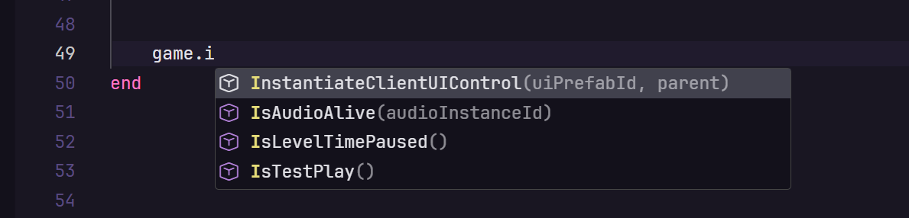

# Miliastra Lua LSP

[简体中文](README.md) | [English](README.en.md)

A Visual Studio Code extension for scripting in *Genshin Impact*'s **Miliastra Wonderland** (千星奇域). It brings full code intelligence — completion, hover, navigation and diagnostics — and ships with the Miliastra runtime API built in.



## Features

| Feature | Description |
| --- | --- |
| Completion | Globals, library functions, fields, methods and keyword snippets |
| Hover | Types, parameter docs, field previews and enum listings |
| Signature help | Parameter list and documentation while typing a call |
| Navigation | Go to definition, go to type definition, find references, workspace symbols |
| Rename | Semantics-aware symbol rename (`F2`) |
| Semantic highlighting | Semantic tokens, switchable to grammar-based coloring |
| Inlay hints | Parameter names, parameter types, variable types, assignment types and return types |
| Diagnostics | Syntax errors plus 30 diagnostic rules, each with its own toggle and severity |
| Code actions | Quick fixes via the lightbulb menu |
| Misc | Document symbols, code folding, color picker, module jump links |

## Installation

Open the Extensions view in VS Code, click `...` in the top-right corner → **Install from VSIX...**, and pick `miliastraLsp-0.0.2.vsix`.

Or from the command line:

```bash
code --install-extension miliastraLsp-0.0.2.vsix
```

### Requirements

- VS Code `1.60.0` or newer
- The **Lua (`sumneko.lua`)** extension must be disabled — both register the same language ID and will conflict otherwise

## Getting started

1. Open your Miliastra script folder in VS Code (open the folder, not a single file).
2. Open any `.lua` / `.luau` file. A language server starts automatically for each workspace folder.
3. An extension status item appears at the bottom left; hover it to see the number of parsed files and memory usage.

Handy shortcuts:

- `Ctrl + Space` — trigger completion manually
- `F2` — rename symbol
- `F12` — go to definition
- `Shift + F12` — find references

## Configuration

Every setting is prefixed with `miliastraLsp.`. Search for `miliastraLsp` in the VS Code Settings UI, or write them straight into `settings.json`:

```json
{
    "miliastraLsp.color.mode": "Semantic",
    "miliastraLsp.completion.enable": true,
    "miliastraLsp.diagnostics.enable": true,
    "miliastraLsp.hint.enable": true,
    "miliastraLsp.workspace.ignoreDir": [
        ".vscode",
        "**/_Index/**"
    ]
}
```

### Common settings

| Setting | Default | Description |
| --- | --- | --- |
| `miliastraLsp.color.mode` | `Semantic` | Coloring mode: `Grammar` or `Semantic` |
| `miliastraLsp.completion.enable` | `true` | Enable auto-completion |
| `miliastraLsp.completion.callParenthesess` | `false` | Automatically insert parentheses when completing a function |
| `miliastraLsp.completion.keywordSnippet` | `Replace` | Keyword snippet style: `Disable` / `Both` / `Replace` |
| `miliastraLsp.completion.workspaceWord` | `true` | Include words from other files in the workspace in completions |
| `miliastraLsp.diagnostics.enable` | `true` | Enable diagnostics and syntax checking |
| `miliastraLsp.diagnostics.globals` | — | Declare extra globals to silence `undefined-global` |
| `miliastraLsp.diagnostics.disable` | — | Disable specific diagnostics by code |
| `miliastraLsp.diagnostics.severity` | — | Per-rule severity: `Error` / `Warning` / `Information` / `Hint` |
| `miliastraLsp.diagnostics.neededFileStatus` | — | Per-rule scope: `Any` / `Opened` / `None` |
| `miliastraLsp.hint.enable` | `false` | Enable inlay hints |
| `miliastraLsp.hint.paramType` | `true` | Show types at parameter positions |
| `miliastraLsp.hover.previewFields` | `100` | Maximum number of fields previewed when hovering a table |
| `miliastraLsp.typeChecking.mode` | `Disabled` | Type checking mode: `Disabled` / `Non Strict` / `Strict` |
| `miliastraLsp.workspace.library` | — | Extra directories to load as external libraries |
| `miliastraLsp.workspace.ignoreDir` | `.vscode`, `**/_Index/**` | Files and directories to ignore (`.gitignore` syntax) |
| `miliastraLsp.workspace.useGitIgnore` | `true` | Respect rules from `.gitignore` |
| `miliastraLsp.runtime.path` | see `settings.json` | Filename search templates used by `require` |
| `miliastraLsp.runtime.fileEncoding` | `utf8` | File encoding; `ansi` is Windows-only |

> All 54 settings are documented in the VS Code Settings UI.

### Diagnostic rules

There are 30 built-in diagnostics, each of which can be re-graded or turned off. They fall roughly into four groups:

- **Doc comments**: `undefined-doc-class`, `undefined-doc-name`, `undefined-doc-param`, `undefined-doc-module`, `doc-field-no-class`, `circle-doc-class`, `duplicate-doc-class`, `duplicate-doc-field`, `duplicate-doc-param`
- **Types and assignments**: `no-implicit-any`, `unbalanced-assignments`, `redundant-value`, `duplicate-index`, `duplicate-set-field`
- **Scope and references**: `undefined-global`, `undefined-env-child`, `global-in-nil-env`, `redefined-local`, `unused-local`, `unused-function`, `unused-vararg`, `deprecated`
- **Code style**: `empty-block`, `trailing-space`, `newfield-call`, `newline-call`, `redundant-parameter`, `unknown-diag-code`

When `miliastraLsp.typeChecking.mode` is not `Disabled`, the server additionally reports type-checking diagnostics along with `undefined-type` and `redefined-type`.

To silence a rule, set its scope to `None`, or list it in `miliastraLsp.diagnostics.disable`:

```json
{
    "miliastraLsp.diagnostics.disable": [
        "undefined-global",
        "trailing-space"
    ],
    "miliastraLsp.diagnostics.severity": {
        "unused-local": "Information"
    }
}
```

## Miliastra API support

The Miliastra runtime API is bundled with the extension, so completion works out of the box with no extra setup:

- **Globals**: `script` (the current script instance), `game` (client-side runtime table), `Color` (color construction and conversion)
- **Types**: `Script`, `Game`, `ColorValue`, `Tween`, `TweenSequence`, `ServerSignal`, `EnumItem` and more
- **Controls**: `ClientUIBaseControl` and its subclasses (`ClientUIImageControl`, `ClientUITextBoxControl`, `ClientUITextWindowControl`, `ClientUIPresetButtonControl`, `ClientUICursorEventAreaControl`, `ClientUIGridScrollerControl`, `ClientUIKeyHintControl`, `ClientUIAnimationControl`, `ClientUIFullscreenAnimationControl`, `ClientUIContainerControl`, `ClientUIReferenceControl`); subclasses inherit their parent's members automatically
- **Enums**: `EaseType`, `Device`, `StageMode`, `LanguageType`, `ParamType`, `CustomVariableEntityType` and more

The standard Lua environment (`string`, `table`, `math`, `utf8`, `debug`, ...) and metatable information are bundled as well.

## Troubleshooting

**Nothing happens — no completion, no diagnostics**

Make sure **Lua (`sumneko.lua`)** is disabled. Both extensions register the same language ID, so they conflict when enabled together.

**`undefined-global` fires for a variable that really exists**

It is a custom global the extension does not know about. Add it to the settings:

```json
{
    "miliastraLsp.diagnostics.globals": [
        "MyGlobal",
        "MyOtherGlobal"
    ]
}
```

**The status item stays on "loading" forever**

Indexing a large project takes a moment on first open. If it never finishes, check the log at `server/log/service.log`.

**Only diagnose the file I have open**

Set `miliastraLsp.diagnostics.neededFileStatus` to `Opened` for the rules you care about to cut background work:

```json
{
    "miliastraLsp.diagnostics.neededFileStatus": {
        "unused-local": "Opened",
        "unused-function": "Opened"
    }
}
```

## Documentation

- [Miliastra API reference (locally generated)](千星奇域API文档%5BDS生成%5D.html)

## Contributing

See [CONTRIBUTING.md](CONTRIBUTING.md) for build, debug and project layout details.

## Credits

- [RobloxLsp](https://github.com/NightrainsRbx/RobloxLsp) — the direct origin of this project
- [sumneko/lua-language-server](https://github.com/sumneko/lua-language-server) — the underlying Lua language server
